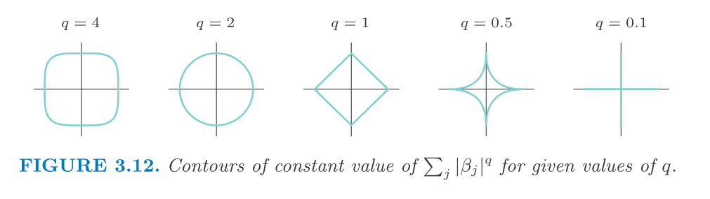

$$
\newcommand{\epe}{\text{EPE}}
\newcommand{\E}{\text{E}}
\newcommand{\mse}{\text{MSE}}
\newcommand{\tdata}{\mathcal{T}}
\newcommand{\bias}{\text{Bias}}
\newcommand{\var}{\text{Var}}
\newcommand{\rss}{\text{RSS}}
\newcommand{\tr}{\text{tr}}
\newcommand{\ridge}{\text{ridge}}
\newcommand{\lasso}{\text{lasso}}
\newcommand{\ls}{\text{ls}}
\newcommand{\tr}{\text{tr}}
\newcommand{\df}{\text{df}}
$$

# Here we discuss **Lasso**.

We define lasso estimate as 
$$\begin{aligned}
  \hat\beta^\lasso &= \arg\min_\beta \sum_i (y_i - X_i\beta)^2 \\
  \text{subject to} &~ \sum_j |\beta_j| \le t
\end{aligned}$$
Again, we need to standardize $X$ and pre-subtract the mean (to account for intercept). 
And similar to ridge, we can write it in the equivalent Larangian form.
$$\begin{aligned}
  \hat\beta^\lasso &= \arg\min_\beta \{\frac{1}{2}\sum_i (y_i - X_i\beta)^2 + \lambda \sum_j |\beta_j|\}
\end{aligned}$$
We can solve lasso problem using quadratic programming but there is an efficient algorithm for computing along the $\lambda$ sequence.
When $t$ is very small, $\hat\beta_j^\lasso = 0, \forall j$. 
And when $t$ is very large such that $t \ge \sum_j |\hat\beta^\ls|$, then $\hat\beta^\lasso = \hat\beta^\ls$.
We can think of the lasso estimate as a continuous subset selection controlled by $t$.
A rough estimate is that for $t = t_\max / 2$, the lasso shrink the least squares estimate by 50% on average.
Sometimes, we use the scalled/standardized $t$, which is $s = t / \sum_j |\hat\beta_j^\ls|$.

# Subset selection, ridge, Lasso

If we have orthogonal (in column) $X$, then these three approach as explicit formula.

* Best subset (size $M$), **hard-thresholding**: $\hat\beta_j^\ls \cdot \mathbb{I}(|\hat\beta_j^\ls \ge |\hat\beta_{(M)}|)$
* Ridge: $\hat\beta_j^\ls / (1 + \lambda)$
* Lasso, **soft-thresholding**: $\text{sign}(\hat\beta_j^\ls)(|\hat\beta_j^\ls - \lambda)_+$

And for non-orthogonal $X$, we consider a general but simple case: 2-dimentional $X$. 
We have the following figure showing the solution.

The contour shows the $\hat\beta$ where the $\rss$ is constant and the center, $\hat\beta$, is lesst sqaures solution. Whenever the ellipse hits the corner of the diamond (for lasso constraint), we will have some coefficient equal to zero as lasso solution.

We can generalize the constraint to arbitrary $q \ge 0$. Say, $\sum_j |beta_j|^q \le k$. And each $q$ value corresponds to a prior distribution of $\beta_j$. 
We have similar figure as before.

From here we can see that $q = 1$ is lasso which is the smallest $q$ such that the constraint is a convex set.
And best subset selection is the most extreme case $q = 0$.

It turns out that it is not worth trying out $q$ other than 0, 1, 2.
Note that for $q \in (1, 2)$, the constraint is differentiable at coordinate so it won't result in sparse solution.
To get some compromise between lasso and ridge, the alternative way (other than setting $q \in (1, 2)$ which gives non-sparse solution), elastic net has been introduced: $\lambda \sum_j (\alpha \beta_j^2 + (1 - \alpha) |\beta_j|)$ which goes induce sparse solution even though we cannot easily see its contour difference from relaxing $q$.

