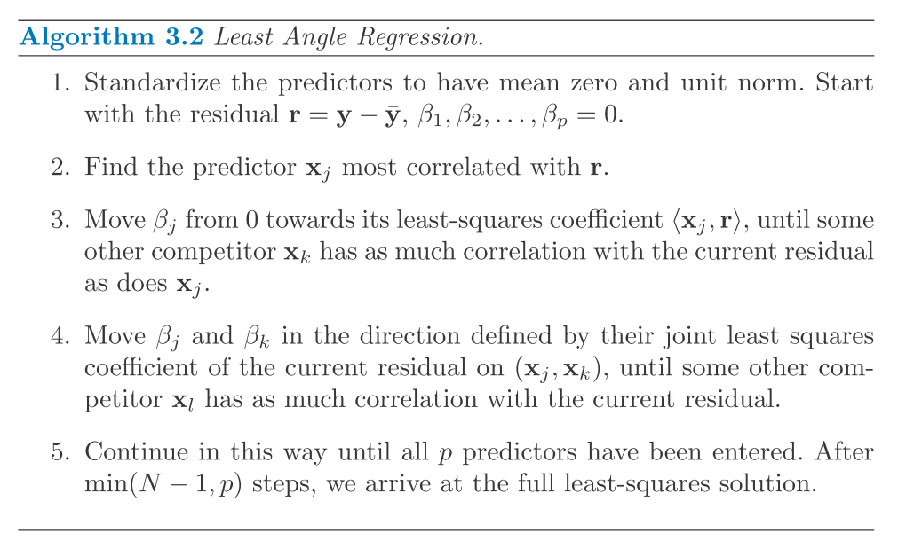
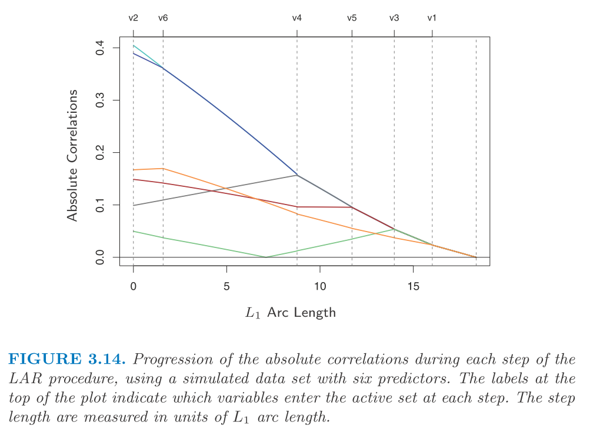
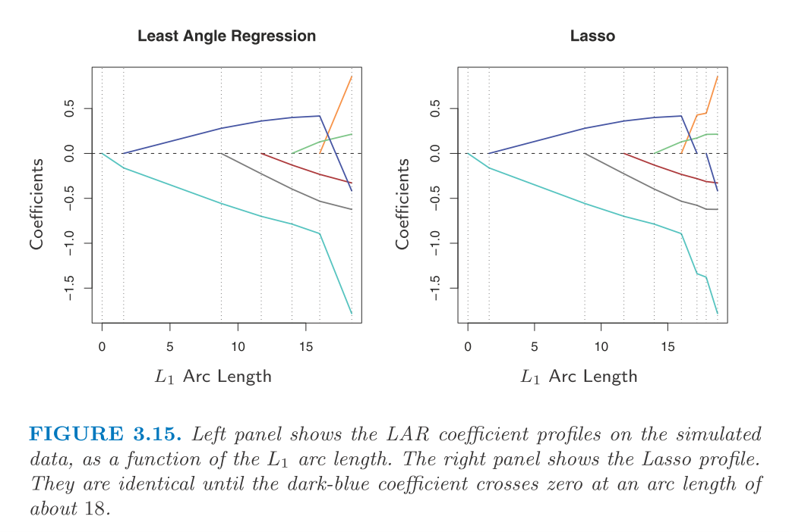
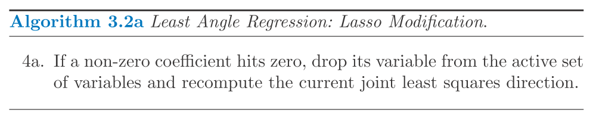
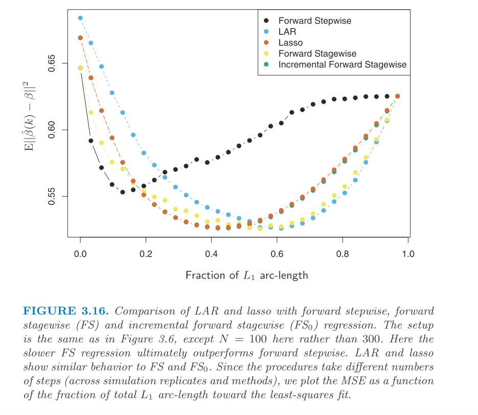

$$
\newcommand{\epe}{\text{EPE}}
\newcommand{\E}{\text{E}}
\newcommand{\mse}{\text{MSE}}
\newcommand{\tdata}{\mathcal{T}}
\newcommand{\bias}{\text{Bias}}
\newcommand{\var}{\text{Var}}
\newcommand{\cov}{\text{Cov}}
\newcommand{\rss}{\text{RSS}}
\newcommand{\tr}{\text{tr}}
\newcommand{\ridge}{\text{ridge}}
\newcommand{\lasso}{\text{lasso}}
\newcommand{\ls}{\text{ls}}
\newcommand{\tr}{\text{tr}}
\newcommand{\df}{\text{df}}
$$

We discuss **Least angle regression** (LAR).

# Least Angle Regression

I should say that this part is completely new to me so I could miss out important aspect when taking the notes. 
And I'm sure that I may want to re-visit this topic whenever I need to.

Similar to forward stepwise regression, at each iteration, it tries to add one more variable into the active set and update the current fit including all active variables. But LAR uses different criteria to include a variable and the update rule is also different.

At first, LAR selects the variable that correlates most with the response. 
The fitting is not a complete fit but we carry of the coefficient of the selected variable such that the correlation between the residual and some other variables are the same as the selected one (we consider the absolute correlation). 
Then, we include that variable into the active set and repeat this procedure.

So, at each iteration, we make sure that the angle between the residual and all variables in the active set are the same. And such angle is descreasing as the procedure goes.
The solution will converge to least squares (LS) solution when all variables are included into the active set.
For completeness, I copy the algorithm of LAR below.

Let go into the details within the iteration. 
Suppose at step $k$, we have active set $A_k$ and we know the coefficient $\beta_{A_k}$ before the update (so that there are $k - 1$ non-zeros and one zero coefficient).
We know that the the residual now is $r_k = y - X_{A_k} \beta_{A_k}$. 

First, we argue that the update direction should be $\delta_k = (X_{A_k}'X_{A_k})^{-1} X_{A_k}' r_k$ which guaranttees that the update $\beta_{A_k}(\alpha) = \beta_{A_k} + \alpha \cdot \delta_k$ satisfy the requirement that the correlations between $r_k(\alpha)$ and $X_{A_k}$ are the same for all variables. 
$$\begin{aligned}
  r_k(\alpha) &= r_k - \alpha X_{A_k} \delta_k \\
  &= r_k - \alpha X_{A_k} (X_{A_k}'X_{A_k})^{-1} X_{A_k}' r_k \\
  X_{A_k}' r_k(\alpha) &= X_{A_k}' r_k - \alpha X_{A_k}' r_k \\
  &= (1 - \alpha) X_{A_k}' r_k
\end{aligned}$$
This results indicates that this update rule will shrink all correlations to residual by a factor of $1 - \alpha$. So if they are the same before, they will be the same after the update.

Also, $u_k = X_{A_k} \delta_k$ makes the smallest angle between all active predictors. And this is where "least angle" comes from.

And the $\alpha$ should be determined by making sure that the maximum correlation of the updated residual and other varible matches what we have in the active set.

At each iteration, a new variable got picked up and we add $\alpha \delta$ to the current coefficients. In the below we show how the residual correlations change as we go along the iterations (from left to right).

Note that we can determine the value of $\alpha$ at each iteration. 
To see this, we can use the relation as below.
$$\begin{aligned}
  X_0' r_k(\alpha) &= X_0' r_k - \alpha X_0' X_{A_k} \delta_k
\end{aligned}$$
, where $X_0$ are the variables outside active set.
A naive thing could do is to go through each of the variable (see the $p$th) in $X_0$ and calculate the $\alpha$ such that $R_{0, k}^p - \alpha (X_0^p)' u_k = (1 - \alpha) R_k$, where $R$ represents the correlation.

Note that the lasso coefficient profile is quite similar to the LAR one.

And they differ when one coefficient passes through zero.
And this leads to a modification of LAR algorithm to solve lasso path.

The LAR algorithm is very efficient (same order of computation as least squares for $p$ predictors). And it always takes $p$ steps to reach LS solution. This algorithm above is efficient to solve lasso problem as any kind especially when $p >> N$.

Next, we want to talk a bit about why LAR path is similar to lasso path. 
First, let's consider LAR at some iteration. 
$$x_j' (y - X\beta) = \gamma \cdot s_j~, \forall j \in A$$
, where $s_j = \{1, -1\}$ representing the sign of the correlation. And by construction 
$$|x_k' (y - X\beta)| \le \gamma ~,\forall k \notin A$$ 

OK, then consider the lasso problem which minimizes $$\frac{1}{2} \|y - X\beta\|_2^2 + \lambda \|\beta\|_1$$.
Let $B$ be the active set in this case. If the variable is differentiable (non-zero), then the stationary condition is (all active variable should satisfy this) $$x_j' (y - X\beta) = \lambda \cdot \text{sign}(\beta_j),~\forall j \in B$$.

So, we can see that as long as $s_j$ matches $\text{sign}(\beta_j)$, the LAR matches the stationary condition of lasso.
Note that $s_j$ won't change the sign in LAR (its magnitude will go down at each iteration). 
And when this variable $j$ got initially picked up $\beta_j$ should be consistent with $s_j$.
So that when $\beta_j$ hits zero and changes the sign, it starts to violate the matched sign requirement. And that's why we need to modify LAR algorithm to handle this situation.

At the end, the performance of forward stepwise, LAR, lasso, and stagewise.

Here we compare the performance along the fitting profile. 
We can see that stepwise improves quickly but it gets overfit afterwards quickly as well and its best performance is not that great. 
Other approaches fits more slowly but they achieve better solution.

# The degrees-of-Freedom formula for LAR and lasso

For a least squares problem with $k$ independent predictors, we can say that the degree of freedom is $k$. 
But if we fit a bset subset selection with $k$ predictors, the degree of freedom is, in principle, greater than $k$.

Here we have a more general definition of effective degree of freedom for the adaptively fitted model.
We define the following.
$$\begin{aligned}
  \df(\hat{y}) &= \frac{1}{\sigma^2} \sum_{i = 1}^N \cov(\hat{y}_i, y_i)
\end{aligned}$$
, where the $\cov$ is the sampling covariance between the predicted and true outcome.
For least squares and ridge regression where we have solution $\hat{y} = H_\lambda y$, we can easily have the dof in closed form: $\df(\hat{y}) = \tr(H_\lambda)$.
The reason is that $$\cov(y_i, \hat{y}_i) = \cov(y_i, H_{i\cdot}y_i) = H_{ii} \var(y_i)$$. 

For the best subset selection, we need to estimate dof by simulation and no closed form could be used.
But for LAR and lasso, it turns out that, after the $k$th step of LAR procedure, **the effective degrees of freedom is exactly** $k$.
For the lasso (modified LAR procedure), at any stage, the dof is approximately equal to the number of predictors. And the approximation works best at the last model in the sequence that contains $k$ predictors. 

