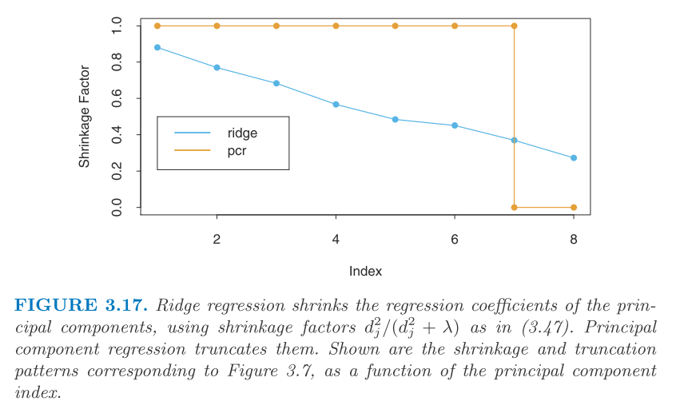
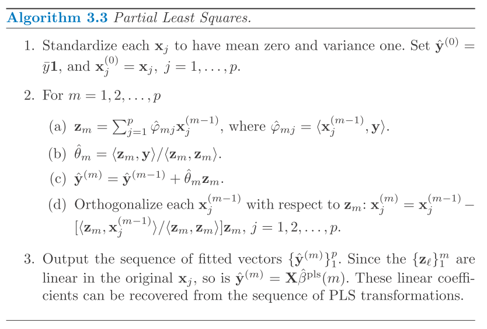

$$
\newcommand{\epe}{\text{EPE}}
\newcommand{\E}{\text{E}}
\newcommand{\mse}{\text{MSE}}
\newcommand{\tdata}{\mathcal{T}}
\newcommand{\bias}{\text{Bias}}
\newcommand{\var}{\text{Var}}
\newcommand{\corr}{\text{Corr}}
\newcommand{\rss}{\text{RSS}}
\newcommand{\tr}{\text{tr}}
\newcommand{\ridge}{\text{ridge}}
\newcommand{\pcr}{\text{pcr}}
\newcommand{\ls}{\text{ls}}
\newcommand{\tr}{\text{tr}}
\newcommand{\df}{\text{df}}
$$

Here we discuss the **Methods using derived input directions**.

These methods are motivated by the fact that predictors are correlated even though there are a large number of them. So, these methods try to produce a smaller number of linear combinations $Z_m, m = 1, \cdots, M$ of the input predictors $X_j, j = 1, \cdots, P$. And use $Z_m$ in place of $X_j$ in the regression. 
These methods differ by how the linear combinations are constructed.

# Principal Components Regression

Here, we set $Z_m$ as the principal component of $X$ matrix, where $z_m = X v_m$. And we typically select the first $M$ principal components. 
Since $z_m$ are orthogonal, we could reduce the subsequent least squares calculation as a sequence of univariate regression where $\hat\theta_m = \langle z_m, y \rangle / \langle z_m, z_m \rangle$.
And we can obtain the estimate in the original space as $\hat\beta^\pcr = \sum_m \hat\theta_m v_m$.

Note that the result is also sensitive to the scaling (PCA is sensitive to scaling), so we need to standardize the input first.
And if $M = P$, it is equivalent to least squares since we work in exactly the same input space (the column space of $X$).
**As comparing to ridge regression**, ridge shrinks the principal direction according to the eigenvalue whereas the PCR discards the $P - M$ smallest eigen directions instead (as shown in below).

# Partial Least Squares 

Here we use both $X$ and $y$ to construct the linear combination. 
Again, it is sensitive to scalingm so we assume $X_j$ is standardized.

The procedure is described below.

1. First we compute $\hat\phi_{1j} = \langle x_j, y \rangle$ for each $j$. 
2. And then we calculate $z_1 = \sum_j \hat\phi_{1j}x_j$ as the first partial least squares direction.
3. Regress out $z_1$ from $y$.
4. Orthogonalize $x_1, \cdots, x_P$ w.r.t. $z_1$ as well.
5. Repeat this procedure until $M (M \le P)$ directions have been obtained.

The algorithm is also shown in below.

For PCR, the $m$th principal component direction $v_m$ is the solution of the following problem.
$$\begin{aligned}
  &\max_\alpha \var(X\alpha) \\
  \text{subject to}~& \|\alpha\| = 1, ~ \alpha' S v_l = 0, ~ \forall l = 1, \cdots, m - 1
\end{aligned}$$
, where $v_l$ are the first $m-1$ principal directions and $S$ is the sample covariance of $X$. Essentially, these conditions are set to ensure that the new direction, $X \alpha$, is orthogonal to the previous ones, $X v_l$.

Similarly, for PLS, the $m$th direction $\hat\phi_m$ solves the following problem.
$$\begin{aligned}
  &\max_\alpha \corr^2(y, X\alpha) \var(X\alpha) \\
  \text{subject to}~& \|\alpha\| = 1, ~ \alpha' S \hat\phi_l = 0, ~ \forall l = 1, \cdots, m - 1
\end{aligned}$$
It turns out that the variance term $\var(X\alpha)$ dominates the objective, so PLS behaves similarly to PCR and ridge.

And if $X$ has orthogonal columns, PLS solves least squares at the first step and the subsequent steps are unnecessary (since the $y$ residual is orthogonal to $X$ residuals).

# Compare "selection" and "shrinkage" methods

Here they did a comparison using some toy data with correlated $x_1$ and $x_2$. 
I only copy the short conclusion here.

> To summarize, PLS, PCR and ridge regression tend to behave similarly.
Ridge regression may be preferred because it shrinks smoothly, rather than in discrete steps. Lasso falls somewhere between ridge regression and best subset regression, and enjoys some of the properties of each.
