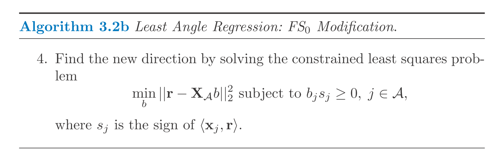

$$
\newcommand{\epe}{\text{EPE}}
\newcommand{\E}{\text{E}}
\newcommand{\mse}{\text{MSE}}
\newcommand{\tdata}{\mathcal{T}}
\newcommand{\bias}{\text{Bias}}
\newcommand{\var}{\text{Var}}
\newcommand{\cov}{\text{Cov}}
\newcommand{\corr}{\text{Corr}}
\newcommand{\rss}{\text{RSS}}
\newcommand{\tr}{\text{tr}}
\newcommand{\ridge}{\text{ridge}}
\newcommand{\pcr}{\text{pcr}}
\newcommand{\ls}{\text{ls}}
\newcommand{\tr}{\text{tr}}
\newcommand{\df}{\text{df}}
\newcommand{\FS}{\text{FS}}
$$

# Incremental Forward Stagewise Regression

This is similar to LAR but they are not the same. The algorithm is as follow (start with standardized features).

1. Start with $\beta_k = 0$ for all $k$ and residual $r = y$.
2. Find $j$th feature that correlates most to $r$.
3. Update $\beta_j = \beta_j + \delta_j$ where $\delta_j = \epsilon \cdot \text{sign}(\langle x_j, r \rangle)$.
4. Update $r = r - \delta_j \cdot x_j$.
5. Repeat 2-4 steps until convergence (r is uncorrelated with any $x$).

It is a generalized version of forward stagewise regression ($\FS_1$). We call it $\FS_\epsilon$.

And $\FS_0$ is the case when $\epsilon \rightarrow 0$ (**infinitesimal forward stagewise regression**).

LAR algorithm with $\FS_0$ modification can solve $\FS_0$ problem. 

$\FS_0$ optimizes a complex problem evolving differential. 
In simple word, $\FS_0$ is more constrained that the lasso so it has less variance than the lasso especially when $p >> N$.

# Piecewise-Linear Path Algorithms

LAR uses the piecewise-linear nature of lasso solution path. Similarly, path-based algorithms can be used for other problems with piecewise-linear solution path.

Suppose we want to solve
$$\begin{aligned}
  \beta &= \arg\min_\beta [R(\beta) + \lambda J(\beta)] \\
  R(\beta) &= sum_{i = 1}^N L(y_i, \sum_j x_{ij} \beta_j)
\end{aligned}$$
, where $R$ and $J$ should be convex.
The followings are sufficient conditions to ensure that the solution path is piecewise-linear.

1. $R$ is quadratic or piecewise-quadratic as a function of $\beta$.
2. $J$ is piecewise linear in $\beta$.

In this case, the solution can be efficiently computed.
Examples are:

* Squared, absolute value losses
* Huberized losses
* $L_1$ and $L_\infty$ penalties on $\beta$
* Hinge loss in SVM (the solution pass of the dual problem is piecewise linear)

# The Dantzig Selector

I paste the problem here without going into more details. 
The problem is similar to lasso but it is much less popular.

# The Grouped Lasso

The penalty term is

$$\begin{aligned}
  \lambda \sum_l \sqrt{p_l} \|\beta_l\|_2
\end{aligned}$$
with $l$ indexes group and $p_l$ indicates the size of the group. This criteria encourages all coefficients belonging to a group $l$ to be zero.
A generalized version is $\|\eta\|_K = (\eta' K \eta)^{\frac{1}{2}}$. Furthermore, allowing overlapping groups.

# Further propertise of the lasso

Many studies have focused on the performance of the lasso with $N$ and $p$ get large. 
One of the assumptions are about the correlation between $X_S$ and $X_S^c$ where $S$ is the set of features with non-zero coefficients in the true model.
For instance, the condition could be
$$
\max_{j \in S^c} \| x_j' X_S (X_S' X_S)^{-1} \|_1 \le 1 - \epsilon, ~\epsilon \in (0, 1] 
$$
In short, in order for the lasso to have good performance, the non-true features should not be too correlated with the true features.

One of the downside of the lasso is that it shrinks the non-zero coefficient to zero which makes it inconsistent (as sample size approaches infinity, it does not converge to the true value). 
To solve this problem, one could use the lasso as a way of feature selection and re-fit the model using non-zeros only. 
In practice, this approach may be computationally demanding (to fit a large number of features simultaneously is not easy). 
In this case, one could use two round of CVs. 
In the first round CV, we do feature selection to select the related features. 
In the second round of CV, we use the selected features only and re-fit the hyper-parameter. 
The intuition is that with a small feature set to begin with, we could use a smaller penalty term which gives less severe shrinkage.
(**Note**: The large penalty is to balance the number of features and the number of samples along with the amont of error)

Furthermore, The *smoothly clipped absolute deviation* (SCAD) is proposed in place of the lasso. It shrinks less on large coefficients (see figure below).

But the cost is that the penalty is not convex anymore which makes it hard to fit.
Along this line, the *adaptive lasso* is proposed which is a weighted version of the lasso, $\sum_k w_i |\beta_k|$ with $w_k = 1 / |\hat\beta_k|^{\nu}$ where $\hat\beta$ is from OLS.
This is an approximation of $\|\beta\|^{1 - \nu}$ penalty.

# Pathwise Coordinate Optimization

This is an alternative algorithm to solve the lasso (other than the LARS) and this approach is based on simple coordinate descent.
Fixing $\lambda$, we loop over $\beta_k$ and update them one at a time.
The objective at each iteration is 
$$\sum_{i = 1}^N (y_i - \sum_{j \ne k} x_{ij} \tilde\beta_j - x_{ik} \beta_k)^2 + \lambda \sum_{j \ne k} |\beta_j| + \lambda |\beta_k|$$
The update rule for this objective is analytical, simply by soft-thresholding:
$$\tilde\beta_k \leftarrow S(y_i - \sum_{j \ne k} x_{ij} \tilde\beta_j, \lambda)$$
where $S(t, \lambda) = \text{sign}(t)(|t| - \lambda)_+$.

In practice, we could start with $\lambda_\max$ such that $\tilde\beta_j = 0, ~\forall j$ and we gradually decreases $\lambda$ with the previous solution as warm-start.
This algorithm is faster than LARS when the problem is large.
We don't get the whole solution path but the solution on a grid of $\lambda$'s.
This algorithm can also be applied to the elastic net and the grouped lasso (in case where the penalty is the sum of functions of the individual parameters). 
It can also be applied to the fused lasso with substantial modification.

# Computational Considerations

The least squares is done by Cholesky decomposition of $X'X$ or QR decomposition of $X$. 
For $X \in \mathbb{R}^{N \times p}$, Cholesky decomp. needs $p^3 + Np^2 / 2$ operations and QR decomp. needs $Np^2$ operations.

Sometimes, Cholesky decomp. is faster but it could be less numerically stable.
The lasso via LAR algorithm has the same complexity as least squares fits.

