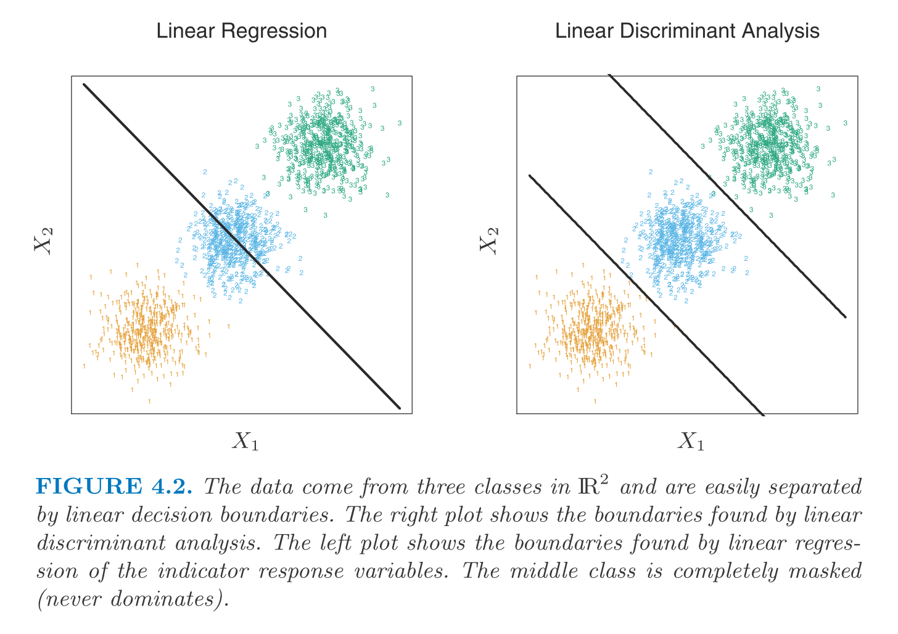
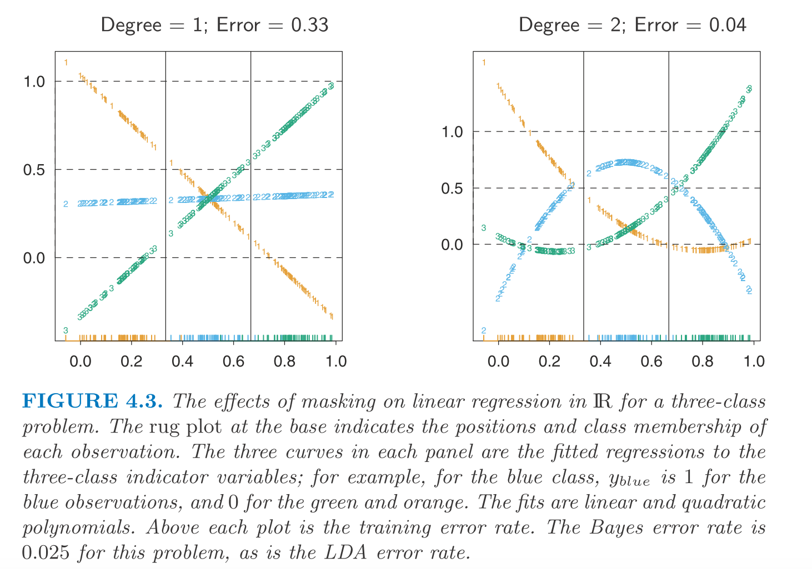

$$
\newcommand{\epe}{\text{EPE}}
\newcommand{\E}{\text{E}}
\newcommand{\mse}{\text{MSE}}
\newcommand{\tdata}{\mathcal{T}}
\newcommand{\bias}{\text{Bias}}
\newcommand{\var}{\text{Var}}
\newcommand{\cov}{\text{Cov}}
\newcommand{\corr}{\text{Corr}}
\newcommand{\rss}{\text{RSS}}
\newcommand{\tr}{\text{tr}}
\newcommand{\ridge}{\text{ridge}}
\newcommand{\pcr}{\text{pcr}}
\newcommand{\ls}{\text{ls}}
\newcommand{\tr}{\text{tr}}
\newcommand{\df}{\text{df}}
\newcommand{\FS}{\text{FS}}
\newcommand{\wt}{\widetilde}
$$
**Linear regression on an indicator matrix**

Here we consider a $K$-class problem and we encode the outcome (class) as one-hot vector.
So, we have $Y \in \mathbb{R}^{N \times K}$ matrix as the observed outcome.
And here we fit the linear regression estimator: $\hat{B} = (X'X)^{-1} X'Y$. 
And $\hat{G}(x) = \arg\max_{g} \hat{f}_g(x)$ with $\hat{f}_g(x) = \hat{B}_{\cdot g}' x$.

One way to think about $\hat{f}_g(x)$ is to treat it as an approximation of $\E(Y_g | X = x) = \Pr(G = g | X = x)$. But the question is how good is the approximation.

Note that when we include intercept in the model, $\sum_g \hat{f}_g(x) = 1, ~\forall x$. See the code verification in below. And we can also verify it by considering $\hat{f}_g(x) = x' (\wt{X}'\wt{X})' \wt{X}'\wt{Y}_g + \bar{Y}_g$ where $\wt\cdot$ is the column-wise centered matrix and $\bar{Y}_g$ is the mean of $Y_g$. 
The key property is that $\sum_g \wt{Y}_g = 0$. 

```{r}
set.seed(2020)
K = 5
N = 100
P = 50
X = matrix(rnorm(N * P), ncol = P)
Y = matrix(0, ncol = K, nrow = N)
for(i in 1 : N) {
  k = sample(K, size = 1)
  Y[i, k] = 1 
}

X_ = cbind(rep(1, N), X)
Bhat = solve((t(X_) %*% X_), t(X_) %*% Y)
nt = 13
x = matrix(rnorm(nt * P), ncol = P)
x_ = cbind(rep(1, nt), x)
yhat = x_ %*% Bhat 
# yhat
rowSums(yhat)
```

But, we cannot ensure that $\hat{f}_g(x) > 0$. Even with this drawback, this approach can yield similar results as compared to the more standard approach.
And if we allow linear regression onto the basis expansions $h(X)$ of the input, it can give consistent result as sample size gets big.

Another view is to think that we try to find $\hat{f}_g(x) = x'\hat{B}_g $ such that we can minimize $\| Y_i - (f_1(X_i), \cdots, f_K(X_i))'\|_2^2$. We can see that it is a special case in Euclidean space.
This view only works when the classes are decoupled. 

There is a problem of this approach when there are more than 2 classes, *i.e.* some classes could be masked by others (see figure below).



The direct issue is that we cannot build a good linear model for "class 2" (when letting class-2 points be labeled as 1 and others have 0 as the label). 
And to augment the feature space with quadratic terms could largely solve this problem.



For the cases of more than three classes, we may need a higher degree of augmentation.
A loose rule is that for $K$ classes, we need $K - 1$ degree of augmentation, which means that we need to deal with $O(p^{K - 1})$ terms. 

And note that the masking problem is prevalent for large $K$ and small $p$! 


