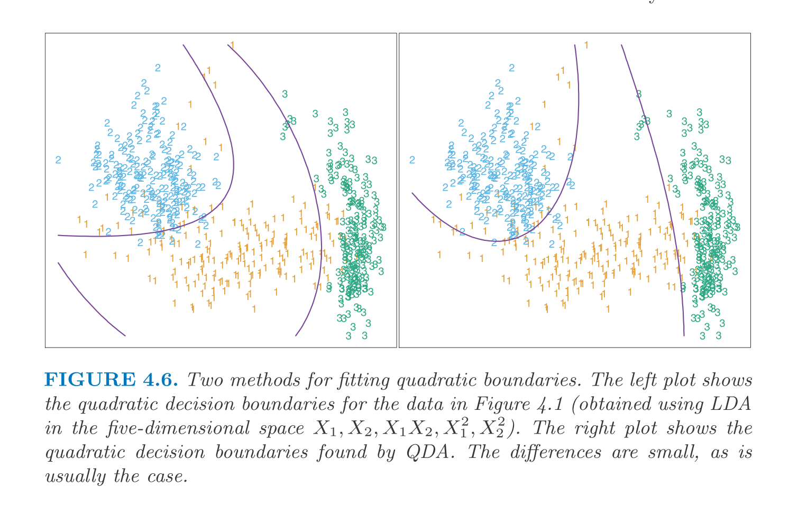
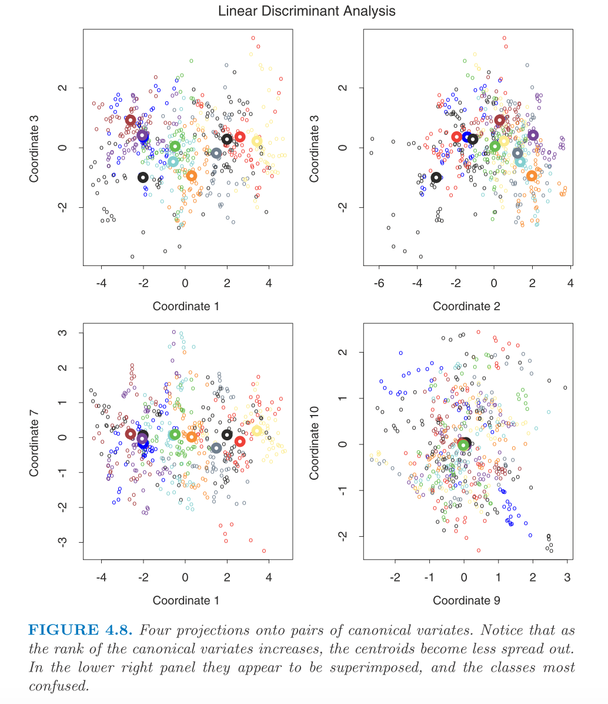

$$
\newcommand{\epe}{\text{EPE}}
\newcommand{\E}{\text{E}}
\newcommand{\mse}{\text{MSE}}
\newcommand{\tdata}{\mathcal{T}}
\newcommand{\bias}{\text{Bias}}
\newcommand{\var}{\text{Var}}
\newcommand{\cov}{\text{Cov}}
\newcommand{\corr}{\text{Corr}}
\newcommand{\rss}{\text{RSS}}
\newcommand{\tr}{\text{tr}}
\newcommand{\ridge}{\text{ridge}}
\newcommand{\pcr}{\text{pcr}}
\newcommand{\ls}{\text{ls}}
\newcommand{\tr}{\text{tr}}
\newcommand{\df}{\text{df}}
\newcommand{\FS}{\text{FS}}
\newcommand{\wt}{\widetilde}
$$
**Linear discriminant analysis**

# Overview 

From the decision theory, the key quantity for a classifier is $\Pr(G | X)$. Suppose $f_k(x) = \Pr(X = x | G = k)$, then we can easily derive $\Pr(G | X)$ by Bayes rule along with prior $\Pr(G = k) = \pi_k$. So, the key function of interest is $f_k(x)$. 
The linear discriminant analysis assumes Gaussian for $f_k(x)$. And there are methods using either non-parametric approach or extra assumptions (*e.g.* Naive Bayes) to estimate $\Pr(X = x | G = k)$.

For LDA, we assume $f_k(x) = \frac{1}{2\pi^{p / 2}|\Sigma_k|^{1 / 2}} e^{-\frac{1}{2} (x - \mu_k)' \Sigma_k^{-1} (x - \mu_k)}$ with extra assumption that $\Sigma_k = \Sigma, ~ \forall k$.
So, the decision boundary could be derived from
$$\begin{aligned}
  \log \frac{\Pr(G = k | X = x)}{\Pr(G = l | X = x)} &= \log \frac{f_k(x)}{f_l(x)} + \log \frac{\pi_k}{\pi_l} \\
  &= \log \frac{\pi_k}{\pi_l} + x' \Sigma (\mu_k - \mu_l) - \frac{1}{2} (\mu_k + \mu_l)' \Sigma^{-1} (\mu_k - \mu_l)
\end{aligned}$$
Note that the simplification comes from the fact that $\Sigma$ is the same across all classes. 
So, here we can conclude that the decision boundary is piece-wise linear.
This property only holds when $\Sigma$ is common.

And we can define $\delta_k(x) = \log \pi_k + x' \Sigma^{-1} \mu_k - \frac{1}{2} \mu_k' \Sigma^{-1} \mu_k$ and the best class is $G(x) = \arg\max_k \delta_k(x)$. 
In practice, we need to estimate $\pi_k$, $\mu_k$, and $\Sigma$.

* $\hat\pi_k = N_k / N$
* $\hat\mu_k = \sum_{i: g_i = k} x_i / N_k$
* $\hat\Sigma = \sum_k \sum_{i: g_i = k} (x_i - \hat\mu_k) (x_i - \hat\mu_k)' / (N - K)$ 

For binary classification with balanced data set ($N_1 = N_2$), LDA is equivalent to the linear regression on indicator matrix. 
But for unbalanced data set, they have different intercepts.
This result implies an approximate way to fit LDA in binary classification, namely to fit the linear regression on indicator matrix first and then re-fit the intercept to minimize the training error.
And for multi-class problems, LDA does not have the issue of masking. 

For a general discriminant problem, $\Sigma_k \ne \Sigma_l$, we have quadratic decision boundary instead, which we call QDA.
In practice, we have another way to fit quadratic boundaries which is to enlarge the feature space by quadratic terms. This approach can yield similar result as QDA but they are distinct approaches.

LDA and QDA are widely used and perform really well. 
And they should always be included as simple tools to compare against.
The reason why these approaches work better than many other more complicated methods is usually not that the Gaussian assumption is correct or the equal covariance assumption is correct. 
The reason could be more about that the sample size can only afford simple models like these (with linear or quadratic boundaries) and these estimators are stable.
This is about bias-variance tradeoff. 
Simple models have higher bias but we have lower variance to estimate the model parameters.

# Regularized discriminant analysis

It makes compromise between LDA and QDA by regularizing $\Sigma_k$. Here we let $\hat\Sigma(\alpha) = \alpha \hat\Sigma_k + (1 - \alpha) \hat\Sigma$. $\alpha$ can be determined by cross-validation.
Moreover, one can regularize $\hat\Sigma$ further, namely $\hat\Sigma(\gamma) = \gamma \hat\Sigma + (1 - \gamma) \hat\sigma^2 I$. So that the RDA can be written as $\hat\Sigma(\alpha, \gamma)$.

# Computations for LDA

The key quantity is $\hat\Sigma_k^{-1}$ and we can compute it via the EVD.
So the procedure is:

* Center the data $X$ and compute $\hat\Sigma$.
* Compute $\hat\Sigma = U D U'$ and let $X^* = D^{1/2} U' X$.

# Reduced-rank LDA

Suppose the input space is $p$-dimensional and we have $K$ classes, we can think of the $K$ classes live in a $(K - 1)$ subspace which is determined by the $K$ centroids (two points determine a line and three points determine a plane, etc).
The orthogonal space won't contribute to the classification since it affects all classes the same.

So, with this reasoning, we should project $X^*$ onto the subspace $H_{K - 1}$ and only consider the distance to the centroid in that space.
For instance, for $K = 3$, naturally we can plot it in the $H_2$ space determined by the three centroids.

And generally speaking, we may want to ask for $H_L \subseteq H_{K - 1}$ with $L \le K - 1$ which is optimal for LDA in some sense. 
Fisher defines the "optimal" to mean that the centroids spread most in the space (in terms of the variance). 
This criteria corresponds to finding the principle component subspace of the centroids.
We have an example on real data in below which also includes 2-dimensional subspace proposed by other methods.

In summary, the procedure to perform reduced-rank LDA is:

* Compute $K \times p$ matrix of the centroids, $M$, and the common covariance matrix $W$.
* Compute $M^* = M W^{-1/2}$ via the EVD of $W$.
* Compute $B^*$ as the covariance matrix of $M^*$ and the EVD of $B^* = V^* D_B (V^*)'$.

The $l$th discriminant variable is $Z_l = v_l' X$ with $v_l = W^{-1/2} v_l^*$.

But Fisher arrived at this approach via another route. The problem he posted is 

> Find the linear combination $Z = a'X$ such that the between-class variance is maximized relative to the within-class variance.

The plot below illustrates why this criteria makes sense.

Note that the between-class variance of $Z$ is $a' B a$ and the within-class variance is $a' W a$ (where $B$ is the covariance of the centroid matrix). 
And $B + W = T$ where $T$ is the total variance of the data ignoring the class information. 
(Remember that $T$ is different from $W$ since when we compute $W$, we need to relative to the class centroid of the point).

With this, Fisher's problem is to maximize the Rayleigh quotient.
$$\max_a \frac{a' B a}{a' W a}$$
Or equivalently, 
$$\max_a a'Ba$$ subject to $a'Wa = 1$.
The solution to this problem is that $a$ is the largest eigenvector of $W^{-1}B$ which is identical to $v_1$. And similarly, we have $a_l = v_l$ where $a_l$ is defined as the direction that maximizes $a'Ba / a'Wa$ and orthogonal to the previous $a_1, \cdots, a_{l-1}$ directions.
We refer $a_l$ to discriminant coordinates or canonical variates (since another derivation relies on the canonical correlation analysis of Y, indicator response matrix, and $X$.

To summarize, we have the following results so far.

* Gaussian classification with common covariance leads to linear decision boundaries. And we can think of it as sphering the data with respect to $W$ (the covariance) and then classify the point according to the closest centroid.
* Since only the relative distance to the centroids matter in the classification, one can consider only the subspace spanned by the centroids.
* This subspace can be further reduced by only keeping the optimal ones. And the resulting procedure is equivalent to the procedure due to Fisher.

Note that the reduced-rank LDA is not only a dimension reduction tool but also applicable for a classification problem. Here, the rationale is that we can further assume that the centroids live in a $L$ dimensional subspace.

Speaking of $\log\pi_k$, it does not show up in determining the direction of the boundaries but it does matter when deciding the cut-point of the boundary. 
Intuitively, if $\pi_k = \pi_l$, we will set the cut-point right in the middle of the two centroids. 
Otherwise, we need to move the cut-point to the centroid that has smaller $\pi$ to improve the error rate.
An example on real data is shown.

There is a close connection between the reduced-rank LDA and the linear regression on the indicator outcome matrix.
LDA is equivalent to the regression followed by EVD of $\hat{Y}'Y$. And LDA on $\hat{Y}$ is equivalent to LDA on the original space.

